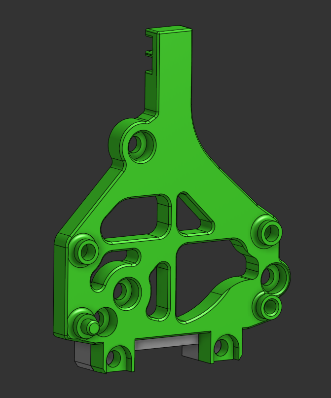

# V0 Board Mount

The micron mount colides with the motor mounts in the back, and the 2020 mount isnt rigid enough.

Hardware:

+ Stock hardware
+ 2x M3x12 screws

## Notes

+ There are 2 spacer versions, one for 20mm standoffs, and one for 16mm standoffs. They are `20-Spacer.stl` and `16-Spacer.stl` respectively.
+ The stock P.U.G holder won't work with 16mm standoffs. You'll have to make a custom one.
+ The spacer has to be mounted as shown in the image, or it will colide with the motor mounts.
+ The fit is a bit tight, so don't tighten the screws until they are all in correct positions.
